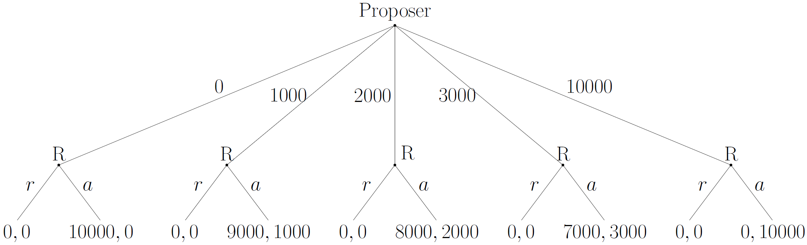
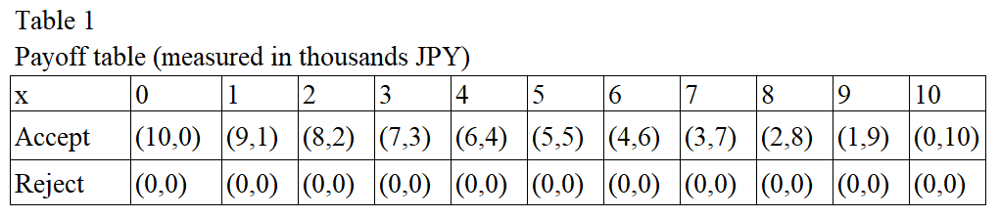
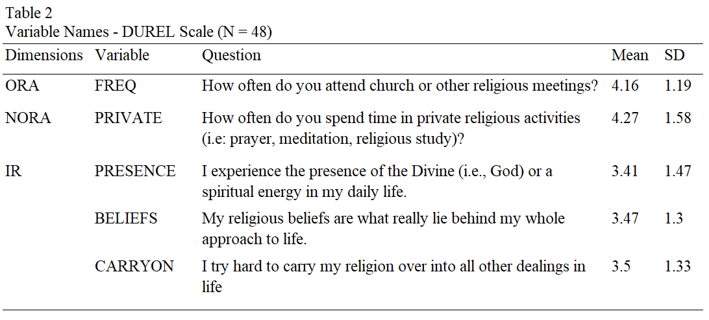
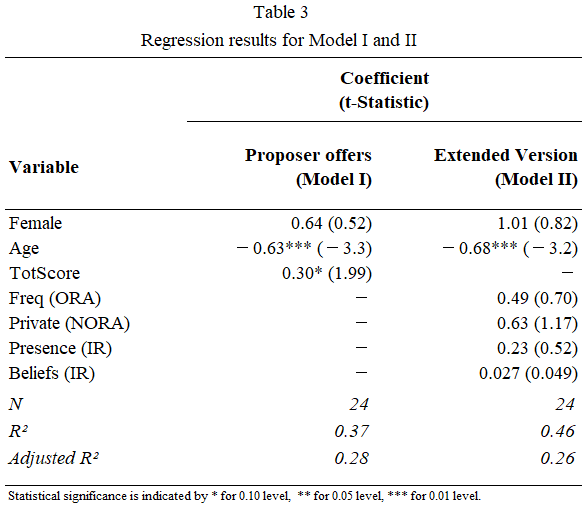
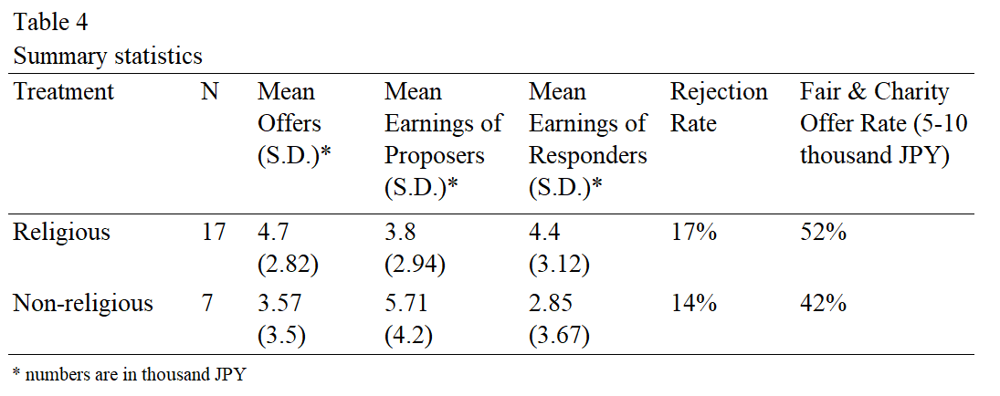
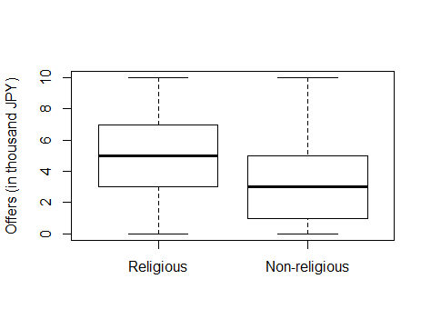

# Does religion generate prosocial behavior?

A multivariate linear regression modeling approach to measure religious prosocial behavior

---
## Table of Contents
- [1. Introduction](#1-introduction)
- [2. Literature Review](#2-literature-review)
    - [2.1. Religion Prosociality in Economics](#2-1-religion-prosociality-in-economics)
    - [2.2. The Ultimatum Bargaining Game](#2-2-the-ultimatum-bargaining-game)
- [3. Methods](#3-methods)
    - [3.1. Measuring Religiosity](#3-1-measuring-religiosity)
- [4. Results](#4-results)
- [5. Conclusion](#5-conclusion)
- [References](#references)
- [Appendix A: Experimental Design Archives](#appendix-a-experimental-design-archives)
---

## 1. Introduction

[(go to next section)](#2-literature-review)

For most people, it is common sense to judge religious people as being more prosocial or generous than non-religious people. In particular, the study of religious prosociality, commonly described as the behavior that intents to benefit others due to one’s religiosity, has been central to explain such association between religion and prosocial behavior, and it has instilled the interest of researchers from different fields in the social sciences.

Although a more complete literature review on religion and prosocial behavior can be found at Norenzayan and Shariff (2008) and Anderson et al. (2010), a comprehensive review is presented [here](#literature-review) to guide the reader towards the understanding on the reasons and premises of the hypothesis set in this work: **that religious individuals are more prosocial than non-religious ones**. 

In this paper, **ultimatum games were utilized as a tool to measure prosocial behavior in an international-based, predominantly Buddhist sample in Japan**. Therefore, a brief literature review of experimental games as a measure of prosocial behavior is also available [here](#2-2-the-ultimatum-bargaining-game). In addition, the findings I present would add to the current literature for three reasons:

1. The sample is broadly international, allowing for less significant cultural bias on experiment results; 
2. Usually, experiments conducted by educational institutions recruit its students as participants. In this work, we were able to include undergraduate, graduate students, and faculty members in the experiment, allowing for a more broad range of ages and background in our sample; 
3. There is a scarce literature that measures prosocial behavior in predominantly Buddhist samples. At the moment this work was done, only Chen & Tang (2009) experiments Tibetan and Han Chinese recipients were found.

The paper proceeds as follows. Section two provides a literature review on religion and prosocial behavior, and the mechanics of the ultimatum bargaining game. Section three describes experiment procedures, section four present results, and section five is a conclusion.   

[back to top](#table-of-contents)

---
## 2. Literature Review

[(go to next section)](#2-1-religion-prosociality-in-economics)

The idea that religion is a driver for generous acts is not a widespread belief by chance. Great part of religious providers finds their own teachings encouraging followers towards more cooperative, generous, or simply “good” acts as a way for salvation, to avoid damnation (as in Christianism), or to better live their lives and coexist with others in harmony. 

As described by Norenzayan and Shariff (2008), there are several evolutionary theories of religion that explain how religion has influenced prosocial behavior among groups. In general, the idea that religion would facilitate groups to coordinate actions (and therefore optimize economic gains), and the idea that individuals are motivated to perform prosocial acts as a way to maintain their own reputation or to avoid supernatural punishments are the most acceptable theories. However, Norenzayan and Shariff (2008) points out that prosocial behavior is a “psychological mechanism” that is usually not related to religion, since it is seen when one’s reputation is put at risk. Therefore, individuals tend to be more prosocial due to a _social vigilante_ aspect: **selfish acts can be condemned by others, and as a result, a selfish individual would be excluded due to a bad behavior**. For instance, economic games have been exploring such aspect. Bolton and Zwick (1995) has observed that recipients, under a lesser degree of anonymity between subject-experimenter, would offer fairer offers to responders in ultimatum games, and McCabe et. al. (1996) has observed more cooperative behaviors when anonymity was reduced on extended bargaining games. 

Although religion and prosocial behaviors seems to lack association, the next session explore religion prosociality in economics using a macro and micro point-of-view, including recent studies that utilized experimental games to raise evidence of association between religion and good behavior.

#### 2.1. Religion Prosociality in Economics

The effects of religion on society has been vastly explored in previous research, with a significant number of mentions to the works of Max Weber on its celebrated sociological work _The Protestant Ethic and the Spirit of Capitalism_ (1930) that sets the stage to relate religion as one of the key factors that influences economic behavior in an individual level. Also, further works in the social sciences pointed out connections between religion and other socioeconomic indicators. For example, Iannacone (1998, p.1466) was one of the first researchers to do so, associating religion with better physical and mental health, marital stability, lower criminal incidence and alcohol and drug consumption rates.

In a broader perspective, Barro and McCleary (2003) reviewed previous economic models when treating religion as either a dependent or independent variable. **Religion as a predicted variable resulted in negative results**; namely, the “secularization” model, where an increase of economic growth leads to a decrease for the demand of religious services, mass participation, and influence of religion on political and economic institutions (Weber, 1930; Berger, 1967; Wilson, 1966), and the model constructed by Azzi and Ehrenberg (as cited in Barro & McCleary, 2003, p.50) which predicted that an increase in real wage would reduce participation in religious activities. Barro and McCleary also cited the works of Finke and Stark (1993), Finke and Iannaccone (1993), Iannaccone and Stark (1994), and Iannaccone (1991) when focusing on the supply-side for religious services, mentioning that governments can negatively influence religious participation through imposing limits of entry for religion providers. 

**Religion as an explanatory variable, however, would have different influences on economic outcomes**. According to Barro and McCleary (2003), religious beliefs such as salvation and damnation would exert a significant influence on an individual’s moral compass, work ethic, and honesty – hence increasing economic outcomes – although such beliefs in certain contexts could also provoke negative economic outcomes such as violence and religious conflicts. In a more elementary level, an individual’s money spent on religious services could also be considered as a factor that negatively influences GDP growth since religious resources such as buildings, sanctuaries, or worship objects would not have a market value, and time spent on religious services is a high opportunity cost against production of outputs in local markets. 

Although there are “mixed feelings” about whether religion, either treated as an independent or dependent variable, would exert an influence in macroeconomic indicators, Orbel et al. (1992) were the first ones to bring the discipline of experimental economics to analyze differences between religious and non-religious subjects, and to explore religion and prosociality in a more intimate level. Using a prisoners’ dilemma game with American subjects, they found out that religion has no effect on cooperative behavior apart from a group of Mormon subjects. Eckel and Grossman (2003 and 2004), utilizing a dictator game, also finds no difference of monetary contributions between American subjects who attend or do not attend religious services. Through conducting both dictator and ultimatum games in Germany, Tan (2006) also finds that religion has no effect on prosocial behavior, although his work included a more accurate measure for religiosity that included other indicators than only religion participation or affiliation, such as religion experience and belief. More recent studies that utilized experimental games would include Anderson et al. (2008), in which authors used a public goods experiment that showed no difference on cooperative behavior between religious and non-religious American subjects, and Grossmann and Parrett (2011) on dictator games in the US with similar results. Both studies utilized religion participation as criteria for the religiosity component. 

#### 2.2. The Ultimatum Bargaining Game

The Ultimatum Bargaining game, a well-known and considerably simple game raised by Güth, Schmittberger, and Schwarze (1982) is utilized in this work and its mechanics presented in this section. The game has the following setting: (1) a proposer, which holds the total amount of money X, and (2) a responder, which initially holds zero amounts, and is dependent from the proposer actions. Then, the proposer has the task to propose a certain quantity of money to the responder from the total amount, and the responder has to either accept or reject such offer. A rejection answer gives both players zero money; a positive answer gives the responder the amount that has been offered, and the remnant amount to the proposer. Figure 1 illustrates the ultimatum game by utilizing the setup of this current research: a proposer who has the task of making an offer between zero to 10,000 Japanese yen (JPY) with a responder. 

&nbsp;

_Figure 1. A representation of the ultimatum game on its extensive form (units in Japanese Yen). Responders have either to reject (r) or to accept (a), and payoffs are described below._

According to the [Theory of Rational Choice](https://www.sciencedirect.com/topics/neuroscience/rational-choice-theory), human beings make choices based upon rationality and utility maximization. If one assumes this theory as valid, both proposers and responders would maximize their economic gains under the ultimatum game. As a result, proposers` offers would tend to approximate the subgame-perfect Nash equilibrium (almost zero), while responders would accept any positive offer (Selten as cited in Güth et al., 1982, p. 368). It is worth mentioning, however, that the setup utilized in this experiment have two subgame perfect Nash equilibria stated below:

1.	A proposer offers ¥1000 to a responder (the lowest amount possible apart from zero), and the responder’s best response would then to always accept the offer;
2.	A proposer offers zero money, and responder would be indifferent between accept or reject the offer.

However, such theoretical predictions were confronted by a “robust phenomenon” observed in past studies, in which proposers, on average, tend to offer around 40-50% of the total amount in the standard version of the ultimatum bargaining game (Güth & Kocher, 2014, p.398). Those offers are usually accepted by the responders. For smaller offers, the responders’ acceptance rates decrease, and approach zero for proposers’ offers below 20% of the total amount.

In this present research, **the hypothesis tested is that religious proposers would offer fairer offers than non-religious proposers, evidencing the fact that religious people tend to be more prosocial than non-religious people**. However, assuming that all subjects would play the ultimatum game with full understanding of the game mechanics, results might match the past findings. Therefore, a hypothesis of this type would challenge that fact, since the literature points for proposer offers going closer to a half the initial endowment.

[back to top](#table-of-contents)

---
## 3. Methods

[(go to next section)](#3-1-measuring-religiosity)

For this experiment, 48 international students ranging from 19 to 33 years (average of 23 years old) were recruited from undergraduate and graduate courses in a university located in Tokyo, Japan, and played the ultimatum bargaining game in classrooms. 41 students are Buddhists, two follows Christianism, one follows Spiritualism, and the remnant four students are Agnostics. The pool of participants is predominantly international: 18 from Southeast Asia, 10 from South America, 8 from East Asia, 4 from South Asia, 3 from Central and North America, 3 from Europe, and 1 from Oceania. Subjects were randomly assigned to proposer and responder roles, and experiments were handled in two days. All proposers are Buddhist practitioners, whereas a few responders are not Buddhists. In order to avoid [learning effects](https://en.wikipedia.org/wiki/Testing_effect), recipients played only one-round of the game. 12 recipients did not show up on time. 

Two classrooms were used, being one designated for proposers and the other for responders. In order to avoid expectations and deception, a unique three-digit number code were given for each player so that players would not possess any information regarding other player`s identities. In addition, tables and seats on classrooms were disposed to be facing the wall so that participants would not be able to look on the other player’s tables, and distance between classrooms was considerably far from each other. Entry and exit times for proposers and responders were also set differently. 

In the beginning of the experiment, participants were asked to remain silent until the end of the experiment. Participants also received a pack of documents containing: (1) instructions of the game accordingly to the role received (see [Appendix A]((#appendix-a-experimental-design-archives)) for instructions); (2) a quiz with four questions to ensure participant`s understanding on the mechanics of the game (see [Appendix A](#appendix-a-experimental-design-archives)); (3) a proposal form (see [Appendix A](#appendix-a-experimental-design-archives)); (4) payoff envelopes. 10 minutes were given for participants to read instructions and answer the quiz. A Q&A session was held afterwards to clarify any questions. Proposers started the game with an initial endowment of 10 false notes of 1,000 Japanese yen (JPY), which totaled 10,000 yen as the whole pie size. A strategy set for proposers (Sp) in this game is defined as being:

$\large Sp ∈ \{0, 1000, 2000, 3000, 4000, 5000, 6000, 7000, 8000, 9000, 10000\}$

while a strategy set for responders (Sr) is consisted on a decision:

$\large Sr ∈ \{accept,reject\}$

and used right after the strategy chosen by proposers is known by responders. A payoff table is shown below (Table 1) with the 11 proposer’s strategy options against the responder’s strategy space.

Proposers were asked to answer the proposal form with their offers, and to put the exact amount of Japanese notes corresponding to their offers in their individual envelope. After, responders received both envelopes and the proposal form, and they had the task to either accept or reject the given offer by answering the form.

Monetary rewards were set in order to stimulate participant`s best response. The proposer with the highest payoff accepted by its respective responder received an award of 2,500 Japanese Yen (JPY). Similarly, the responder with highest payoff was also given the same prize. Ties were observed in this experiment – in such case, the winner was randomly chosen among tied players.

#### 3.1. Measuring Religiosity

In order to measure participant’s religiosity, all recipients were asked to answer a Likert-scaled questionnaire of 20 items, in which five of them were taken from [the Duke University Religion Index (DUREL)](https://scholars.duke.edu/display/pub960636). The remnant 15 questions were related to Politics, Economics, and Culture as distractors, and were worded in neutral language in order to avoid framing effects (Tversky & Kahnemann, 1981). Questionnaires were done online before the experiment time (see [Appendix A](#appendix-a-experimental-design-archives) for raw results).

The DUREL model was chosen for having the best fit for the purposes of this research since it measures religiosity in a multidimensional fashion. Apart from Tan (2006), past research has considered participation frequency on religious activities as the main indicator for religiosity (see Parrett & Grossmann, 2011; Anderson & Mellor, 2009; Anderson, Mellor & Milyo, 2010; Eckel & Grossmann, 2004), although the measurement of religiosity requires a more complete assessment that considers at least 10 major dimensions of religiosity (Koenig, 2015, p.530), named: (1) belief; (2) religious motivation; (3) organizational religious activities (ORA), (4) non-organizational activities (NORA); (5) attachment to God; (6) trust in God; (7) religious experience; (8) religious coping; (9) religious maturity; and (10) religion exposure. Another indicator that contains some of the dimensions mentioned above and is included in the DUREL scale is intrinsic religiosity (IR), which is described as the dimension that measures individuals who consider religion as an end in itself, “a master motive” (Masters, 2013). For this experiment, Koenig’s recommendation on the usage of the DUREL scale were followed, given that it covers ORA, NORA, and IR dimensions, making it a comprehensive measure for religiosity in this research. 
 
DUREL questions were adapted given the predominance of Buddhist practitioners in this experiment. Since each question is represented by a variable in the model to be specified further, variable name were added and summary statistics of participant’s answers is given in table 2.

Questions for ORA and NORA dimensions go on a range of 1-6, whereas questions for IR go on a range of 1-5 – totaling 27 points for all five questions. A "1" answer stands for “definitely not true” or “never” type of answer, whereas a "6" answer means “definitely true” or “always”. 

Internal consistency of the likert-scaled DUREL questions was also analyzed after receiving the answers from participants. Considering all five questions, a [Cronbach alpha](https://en.wikipedia.org/wiki/Cronbach%27s_alpha) of 0.65 was obtained, and an alpha of 0.75 was observed when removing the CARRYON variable. Since removing the latter variable gives a more consistent measure of religiosity, the variable CARRYON was not considered for the specification model. 

In this paper, **two linear regression models were modeled** with proposer offer (measured in Japanese yen - labeled as PROPOFFER) as the dependent variable, **being the first one (Model I) a more general specification**:

$PROPOFFER_i = \beta_0 + \beta_1Female_i + \beta_2Age + \beta_3Totscore_i + \varepsilon_i$

where:

$Female$ = dummy variable for gender where 1 equals female, zero otherwise;
$Age$ = age of participant $i$;
$Totscore$ = total score obtainable in the DUREL scale by each participant $i$;

and **the second one (Model II) a extended version considering all dimensions of religiosity** described above (refer to table 2):

$PROPOFFER_i = \beta_0 + \beta_1Female_i + \beta_2Age + \beta_3Freq_i + \beta_4Private_i + \beta_5Presence_i + \beta_6Beliefs_i + \varepsilon_i$

The need for two models relies on the fact that: (1) the first model would consider religiosity as a sum of all dimensions, allowing for more comprehensive results; (2) the second model would address which dimension plays a role on offers made by proposers. As mentioned in the previous section, past studies have relied only on the FREQ variable to measure prosocial behavior coming from religiosity, but it might be the case that other aspects of religiosity would have a role on more generous offers.

[back to top](#table-of-contents)

---
## 4. Results

[(go to next section)](#5-conclusion)

Results of the multiple regression analysis for the general model (I) and its extended version (Model II) are presented below on table 3:

In the Model I, the coefficient for the variable AGE is significant and negative. In general, proposer offers were higher for younger participants, although 75% of subjects are around 20-25 years old. For the variable TOTSCORE, coefficient is positive and significant (p<0.10), which goes on the contrary hand of the results of other laboratories in which there were, in most cases, no significant behavioral differences between religious and non-religious participants. 

Model II shows results considering all DUREL dimensions. Again, the coefficient for the variable AGE is significant and negative, in which the reasons were stated above as for the general model. No other variable is significant, which suggests that there is no single religiosity dimension that plays a decisive role on more generous offers. However, if religiosity is seen as a general score indicator (model I) depicted by TOTSCORE, then it could be possible to infer that participants with higher religiosity might be more willing to offer higher stakes than ones with lower religiosity levels.  

Given the number of participants for this experiment, a non-parametric statistical test was utilized. Sample was divided into “religious” and “non-religious” by using a cutoff of 18 points on the variable TOTSCORE. Since all proposers come from a Buddhist background, this cutoff number was adapted according to the conventions of the Buddhist practice, such as two-time daily praying sessions (one in the morning, another in the evening), and more than once a month gathering meetings at Buddhist centers. Participants who scored below 18 points were allocated in the “non-religious” treatment, whereas participants whose score marked above the cutoff were allocated in the “religious” treatment.  

The raw data of all offers can be found in [Appendix A](#appendix-a-experimental-design-archives). For the religious group, it was observed that mean offers are on par with the existent literature. On average, proposers offered 4,700 Japanese Yen (JPY) to responders out of 10,000 JPY (around 47% of the total endowment), with 17% of responders rejecting offers. It was also observed that 52% of proposers opted for more “fair and charity offers” (terminology referencing to proposers offering more or equal than 50% of the total endowment, in this case x > 5,000), which supports the idea that proposer mean offers would go strictly close to half the initial endowment. In the non-religious treatment, mean offers counts for 3,570 JPY (35% of the total endowment), with a rejection rate of 14%. Fair and charity offers were fewer than its counterpart treatment, with around 42% of proposers opting for such offers. The experimental data is summarized in Table 4.

For the given sample size, the null hypothesis that there is not a significant change on proposer offers between religious and non-religious treatments was not rejected (U = 73.5, p = 0.38), although more fair offers (X=5,000) and charity offers (5,000 < X ≤ 10,000), were observed in the religious group, which is illustrated in the boxplot in Figure 2.

_Figure 2. Proposer offers done by religious and non-religious participants._

It is notable to mention the disparity between the sample size of the religious and non-religious groups, being the religious one the largest. However, even though religious participants outnumbered around two times the non-religious ones, the results still reflect the findings of the current literature: **there is little evidence of prosocial behavior disparities between non-religious or religious people.**

[back to top](#table-of-contents)

---
## 5. Conclusion

[(go to next section)](#references)

In this paper, it is explored whether religious participants are more prone to generous offers than non-religious ones in a one-shot ultimatum bargaining game in a predominantly Buddhist sample. Overall, there is little evidence that religious participants would have more prosocial behavior than non-religious participants, although results obtained in the general model (I) shows evidence of religious subjects being more prosocial than non-religious ones. In this model, it was considered measuring religious prosocial behavior as a multidimensional construct, in which the sum of all religiosity dimensions’ scores was put into one universal score (TOTSCORE). As observed, this construct allowed for a more consistent and comprehensive measurement of religiosity, and it might support future experimenters to better measure religiosity across subjects. 

An important matter to be considered was the sample size. Among 700 international students located in the educational institution where experiments were conducted, only 6% was reached to participate in this experiment. Therefore, an increase of subjects would greatly benefit the results presented above, and further experiment trials with bigger sample size are recommended. However, there is little belief that future results would greatly differ from what is presented here, since reputation aspects would stimulate even non-religious subjects to behave in a prosocial manner no matter the degree of religiosity (refer to literature review for details). Therefore, in order to obtain results that would show evidence of religion prosociality, it would be needed a consistent number of religious subjects offering even more fair offers to its respective responders. 

In addition, a greater monetary incentive would stimulate more participants to join, and possibly resulting in more accurate behavior in this game. In order to make up for this potential issue, false Japanese notes were used as a remedial strategy instead of real money when handling experiments, and real monetary rewards were given only to “winners”. 

Overall, the findings presented in this paper open a range of possibilities for future research. Even though we failed to reject the hypothesis, it was evident that religious recipients offered more fair offers than non-religious ones, which could indicate that religion has a role on influencing individuals to pursue and have a more prosocial behavior towards others, and society. 

[back to top](#table-of-contents)

---
## References

[(go to next section)](#appendix-a-experimental-design-archives)

Anderson, L., Mellor, J., & Milyo, J. (2010). Did the devil make them do it? The effects of religion in public goods and trust games. Kyklos, 63(2), 163-175.

Anderson, L. R., & Mellor, J. M. (2009). Religion and cooperation in a public goods experiment. Economics Letters, 105(1), 58-60.

Berger, P. L. (2011). The sacred canopy: Elements of a sociological theory of religion. Open Road Media.

Bolton, G. E., & Zwick, R. (1995). Anonymity versus punishment in ultimatum bargaining. Games and Economic behavior, 10(1), 95-121.

Brooks, A. C. (2003). Religious faith and charitable giving. Policy Review, (121), 39.

Chen, K., & Tang, F. F. (2009). Cultural differences between Tibetans and ethnic Han Chinese in ultimatum bargaining experiments. European Journal of Political Economy, 25(1), 78-84.

Crockett, M. (2017). How populism taps into the human desire for punishment - a psychologist explains. World Economic Forum. Retrieved from: https://www.weforum.org/agenda/2017/01/how-populism-taps-into-the-human-desire-for-punishment/

Finke, R., & Iannaccone, L. R. (1993). Supply-side explanations for religious change. The Annals of the American Academy of Political and Social Science, 527(1), 27-39.

Finke, R. & Stark, R. (1992). The Churching of America 1776-1990. New Brunswick, NJ: Rutgers University Press.

Güth, W., & Kocher, M. G. (2014). More than thirty years of ultimatum bargaining experiments: Motives, variations, and a survey of the recent literature. Journal of Economic Behavior & Organization, 108, 396-409.

Güth, W., Schmittberger, R., & Schwarze, B. (1982). An experimental analysis of ultimatum bargaining. Journal of Economic Behavior & Organization. 3, 367–388.

Grossman, P. J., & Parrett, M. B. (2011). Religion and prosocial behaviour: A field test. Applied Economics Letters, 18(6), 523-526.

Eckel, C. C., & Grossman, P. J. (2003). Rebate versus matching: does how we subsidize charitable contributions matter?. Journal of Public Economics, 87(3-4), 681-701.

Eckel, C. C., & Grossman, P. J. (2004). Giving to secular causes by the religious and nonreligious: An experimental test of the responsiveness of giving to subsidies. Nonprofit and Voluntary Sector Quarterly, 33(2), 271-289.

Iannaccone, L. R. (1991). The consequences of religious market structure: Adam Smith and the economics of religion. Rationality and society, 3(2), 156-177.

Iannaccone, L. R., & Stark, R. (1994). A supply-side reinterpretation of the" secularization" of Europe. Journal for the scientific study of religion, 230-252.

Iannaccone, L. R. (1998). Introduction to the Economics of Religion. Journal of Economic Literature, 36(3), 1465-1495. 

Koenig, H. G., Al Zaben, F., Khalifa, D. A., & Al Shohaib, S. (2015). Measures of religiosity. In Measures of personality and social psychological constructs (pp. 530-561). Academic Press.

Masters K.S. (2013) Intrinsic Religiousness (Religiosity). In: Gellman M.D., Turner J.R. (eds) Encyclopedia of Behavioral Medicine. Springer, New York, NY.

McCabe, K. A., Rassenti, S. J., & Smith, V. L. (1996). Game theory and reciprocity in some extensive form experimental games. Proceedings of the National Academy of Sciences, 93(23), 13421-13428.

McCleary, R. M., & Barro, R. J. (2006). Religion and economy. Journal of Economic Perspectives, 20(2), 49-72.

Norenzayan, A., & Shariff, A. F. (2008). The origin and evolution of religious prosociality. science, 322(5898), 58-62.

Orbell, J., Goldman, M., Mulford, M., & Dawes, R. (1992). Religion, context, and constraint toward strangers. Rationality and Society, 4(3), 291-307.

Porta, R. L., Lopez-De-Silane, F., Shleifer, A., & Vishny, R. W. (1996). Trust in large organizations (No. w5864). National Bureau of Economic Research.

Shariff, A. F., & Norenzayan, A. (2007). God is watching you: Priming God concepts increases prosocial behavior in an anonymous economic game. Psychological science, 18(9), 803-809.

Tan, J. H. (2006). Religion and social preferences: An experimental study. Economics Letters, 90(1), 60-67.

Tversky, A., & Kahneman, D. (1981). The framing of decisions and the psychology of choice. Science, 211(4481), 453-458.

Ruffle, B. J., & Sosis, R. H. (2003). Does it pay to pray? Evaluating the economic return to religious ritual.

Weber, M. (1930). The Protestant Ethic and the Spirit of Capitalism [1904–5]. na.

Wilson, B. (1966). Religion in the Secular Society: A Sociological Comment. Watts, London.

[back to top](#table-of-contents)

---

## Appendix A: Experimental Design Archives

|No|Archive Name|Link|
|--|--|--|
|1|Instructions for Proposers|--|
|2|Instructions for Responders|--|
|3|Quiz|--|
|4|Proposal Form|--|
|5|Questionnaire Results|--|
|6|Proposer Offers and Final Results|--|

[back to top](#table-of-contents)

---